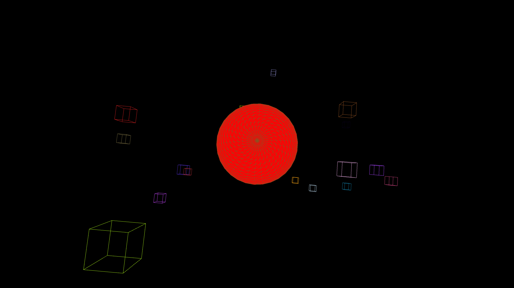
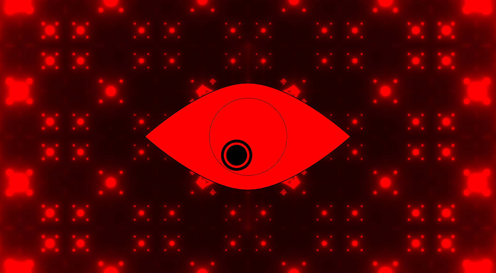

# Music Visualiser Project

Name: Karl Negrillo  
Student Number: C22386123

Name: Matiss Jurevics  
Student Number: C22501743

# Description of the assignment
In this assignment, we have decided to do one visual each and code it using Java Processing. The visualisation are based on the music track
called "RATATA" by Skrillex, Missy Elliot & Mr. Oizo. For Karls visual, the audio level directly influences the movement speed of the cubes, making the visualization dynamically respond to the music's volume and intensity. For Matiss's Visual, the audio-visual interaction provides a dynamic and responsive experience where audio inputs directly influence visual outputs (Shaders and Animation). 

# Instructions
- Compile and Run Main.java from ie.tudublin package
- Press Space Bar to Start and Reset
- **Visualisation**: Arrow keys will switch back or forward from each scene
- Order of Apperance: Karl's Visual, then Matiss's Visual

# How it works
- Each memeber has its own directory containing the visualisation
- We have an aggregate file called Controller.java in ie.main. This is used to run the visualisation using a controller, draw the sketch, 
and able to switch to different scenes. This file is made in ie.main package for convenience.

## Karls Visual


## Matiss's Visual


# What I am most proud of in the assignment

# Markdown Tutorial

This is *emphasis*

This is a bulleted list

- Item
- Item

This is a numbered list

1. Item
1. Item

This is a [hyperlink](http://bryanduggan.org)

# Headings
## Headings
#### Headings
##### Headings

This is code:

```Java
public void render()
{
	ui.noFill();
	ui.stroke(255);
	ui.rect(x, y, width, height);
	ui.textAlign(PApplet.CENTER, PApplet.CENTER);
	ui.text(text, x + width * 0.5f, y + height * 0.5f);
}
```

So is this without specifying the language:

```
public void render()
{
	ui.noFill();
	ui.stroke(255);
	ui.rect(x, y, width, height);
	ui.textAlign(PApplet.CENTER, PApplet.CENTER);
	ui.text(text, x + width * 0.5f, y + height * 0.5f);
}
```

This is an image using a relative URL:


This is an image using an absolute URL:


This is a youtube video:

[](https://www.youtube.com/watch?v=J2kHSSFA4NU)

This is a table:

| Heading 1 | Heading 2 |
|-----------|-----------|
|Some stuff | Some more stuff in this column |
|Some stuff | Some more stuff in this column |
|Some stuff | Some more stuff in this column |
|Some stuff | Some more stuff in this column |

